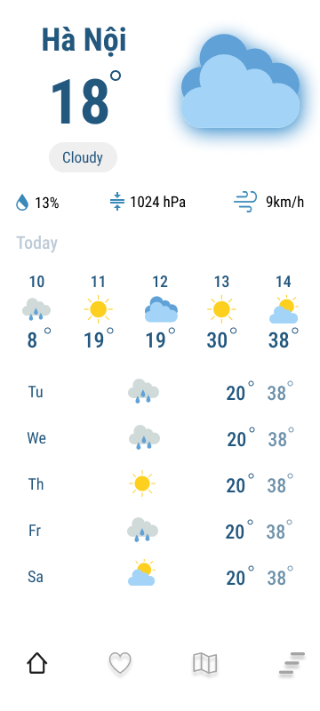

# 1. Weather


Sử dụng React Native phát triển một ứng dụng thời tiết với yêu cầu như sau: 

1. Xem thời tiết khu vực hiện tại
  
  - Hiển thị thông tin thời tiết hiện tại. 
  - Hiện thị thông tin thời tiết 5 giờ tiếp.
  - Hiện thị thông tin thời tiết 5 ngày tiếp.
  - Sử dụng API của openweather map để lấy thông tin thời tiết. [Xem thêm](https://openweathermap.org/api/one-call-3)


  ```
  GET: https://api.openweathermap.org/data/3.0/onecall?lat={lat}&lon={lon}&exclude={part}&appid={API key}

  ```

  * Mô tả API

  | Parameter | Mô tả |
  | --- | ----------- |
  | lat, lon | Tọa độ vị trí hiện tại |
  | appid | key dùng để authentication & authorization. Inbox để lấy key |
  | exclude | Tham số có thể dùng để loại bỏ một số dữ liệu trả về. (current, minutely, hourly, daily, alerts)
  | units | Đơn vị đo |
  | lang | Chọn ngôn ngữ [Xem thêm](https://openweathermap.org/api/one-call-3#multi)

  * Ví dụ:

  ```
  https://api.openweathermap.org/data/3.0/onecall?lat=21.0309072&lon=105.7817332&appid=ABC

  ```

  * Response

  ```json
  {
    "lat": 21.0309,
    "lon": 105.7817,
    "timezone": "Asia/Bangkok",
    "timezone_offset": 25200,
    "current": {
        "dt": 1663906816,
        "sunrise": 1663886747,
        "sunset": 1663930386,
        "temp": 305.2,
        "feels_like": 310.34,
        "pressure": 1011,
        "humidity": 60,
        "dew_point": 296.46,
        "uvi": 9.41,
        "clouds": 27,
        "visibility": 10000,
        "wind_speed": 3.03,
        "wind_deg": 12,
        "wind_gust": 3.83,
        "weather": [
            {
                "id": 802,
                "main": "Clouds",
                "description": "scattered clouds",
                "icon": "03d"
            }
        ]
    },
    "minutely": [
        {
            "dt": 1663906860,
            "precipitation": 0
        },
        {
            "dt": 1663906920,
            "precipitation": 0
        },
    ],
    "hourly": [
        {
            "dt": 1663905600,
            "temp": 305.2,
            "feels_like": 310.34,
            "pressure": 1011,
            "humidity": 60,
            "dew_point": 296.46,
            "uvi": 9.41,
            "clouds": 27,
            "visibility": 10000,
            "wind_speed": 3.03,
            "wind_deg": 12,
            "wind_gust": 3.83,
            "weather": [
                {
                    "id": 802,
                    "main": "Clouds",
                    "description": "scattered clouds",
                    "icon": "03d"
                }
            ],
            "pop": 0.33
        },
        {
            "dt": 1663909200,
            "temp": 304.92,
            "feels_like": 309.41,
            "pressure": 1011,
            "humidity": 59,
            "dew_point": 295.92,
            "uvi": 10.23,
            "clouds": 30,
            "visibility": 10000,
            "wind_speed": 2.68,
            "wind_deg": 26,
            "wind_gust": 3.57,
            "weather": [
                {
                    "id": 802,
                    "main": "Clouds",
                    "description": "scattered clouds",
                    "icon": "03d"
                }
            ],
            "pop": 0.37
        },
        
    ],
    "daily": [
        {
            "dt": 1663905600,
            "sunrise": 1663886747,
            "sunset": 1663930386,
            "moonrise": 1663877640,
            "moonset": 1663925460,
            "moon_phase": 0.91,
            "temp": {
                "day": 305.2,
                "min": 296.33,
                "max": 305.31,
                "night": 297.74,
                "eve": 300.9,
                "morn": 296.47
            },
            "feels_like": {
                "day": 310.34,
                "night": 298.45,
                "eve": 303.71,
                "morn": 297.26
            },
            "pressure": 1011,
            "humidity": 60,
            "dew_point": 296.46,
            "wind_speed": 4.3,
            "wind_deg": 165,
            "wind_gust": 6.87,
            "weather": [
                {
                    "id": 500,
                    "main": "Rain",
                    "description": "light rain",
                    "icon": "10d"
                }
            ],
            "clouds": 27,
            "pop": 0.77,
            "rain": 2.03,
            "uvi": 10.23
        }
    ]
}
  ```


2. Thời tiết các thành phố yêu thích:
  
  - Cho phép người dùng tìm kiếm thành phố và có thể thêm thành phố đó vào mục yêu thích.

  - Hiển thị tình trạng thời tiết hiện tại của các thành phố yêu thích.

3. Sử dụng firebase push notification thông báo khi có sự kiện về bão lũ, ngập lụt. Khi người dùng click thông báo sẽ hiển thị ra 1 bài báo nói về tin tức đó. 

- Ví dụ: Chuẩn bị có siêu Maon. Push 1 notification thông báo về bão Maon. Khi click vào notification hiển thị bài báo về siêu bão Maon (https://vnexpress.net/bao-maon-gay-mua-to-tu-chieu-nay-4503611.html) trên App.

### Target

- Làm quen các core component trong mobile
- Navigation giữa các screen
- Giao tiếp với api
- Handling notification trong app
- Xây dựng reuse component
- Quản lí state của app trong mobile
- Làm việc với native devices features(Location) trong mobile