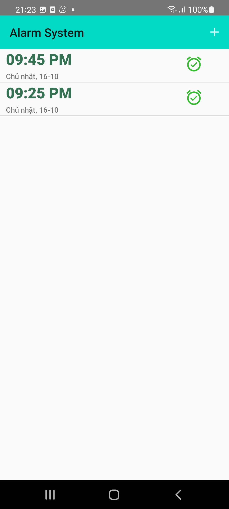
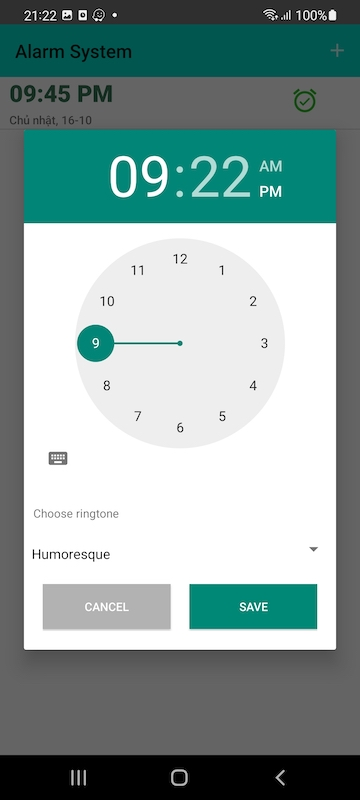
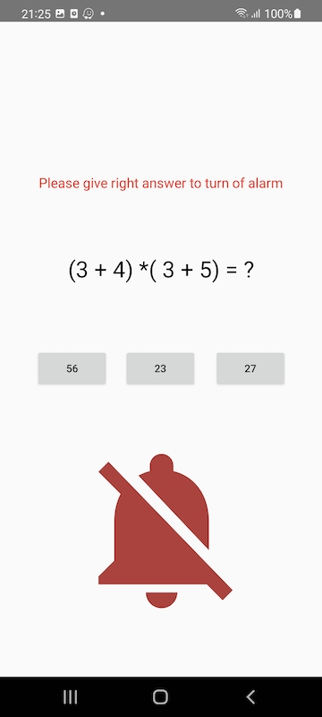

# 2. Smart Alarm App
Xây dựng app báo thức sử dụng native code Android (Java)

## Yêu cầu
<!-- 

 -->

   

- Khởi tạo báo thức với nhiều loại chuông(ringstone) khác nhau
- Báo thức có thể được update
- Báo thức cũ được lưu trữ lại
- Để Tắt báo thức phải trả 1 câu hỏi bất kì(Có thể set 1 tập câu hỏi có sẵn) gồm 3/4/5 đáp án. Nếu trả lời đúng thì mới tắt được báo thức
- Báo thức báo được trong chế độ Off-Screen
- Cập nhật cho phép cấu hình lặp lại báo thức 
  - Nếu chọn Lặp Lại thì cho phép chọn thứ. Ví dụ chọn Thứ 2 lặp lại thì tự động các ngày thứ 2 trong tuần sẽ lặp lại. Tương tự nếu chọn thứ 2, 3 ,4 ,5 ... thì tự động lặp lại thứ 2, 3, 4 ,5
  - Nếu không chọn Lặp Lại thì báo thức theo cơ chế bình thường (Nếu thời gian setup báo thức < thời gian hiện tại thì có nghĩa sẽ báo thức sang ngày hôm sau)

### Kỹ thuật sử dụng

RingstoneManager, BroastcaseReceiver, Service, SQLite (Room Database)

