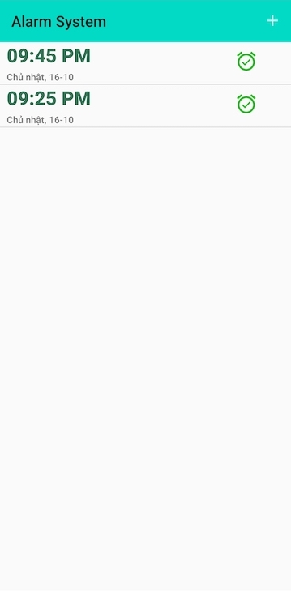
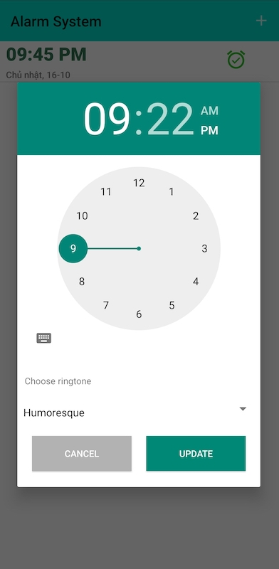
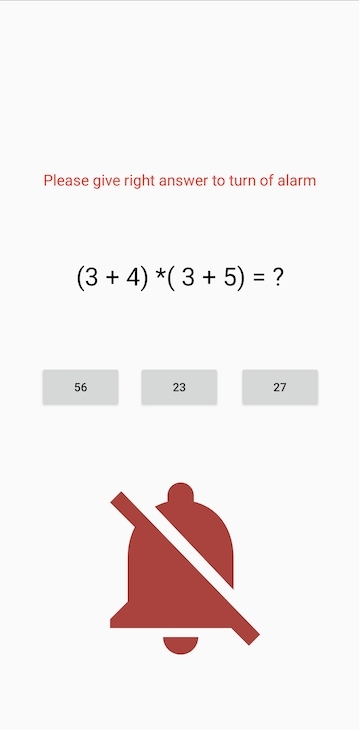

# 2. Smart Alarm App
Xây dựng app báo thức sử dụng native code Android (Java)

## Yêu cầu

- Khởi tạo báo thức với nhiều loại chuông(ringstone) khác nhau
- Báo thức có thể được update
- Báo thức cũ được lưu trữ lại
- Để Tắt báo thức phải trả 1 câu hỏi bất kì(Có thể set 1 tập câu hỏi có sẵn) gồm 3/4/5 đáp án. Nếu trả lời đúng thì mới tắt được báo thức
- Báo thức báo được trong chế độ Off-Screen

### Kỹ thuật sử dụng

RingstoneManager, BroastcaseReceiver, Service, SQLite (Room Database)

