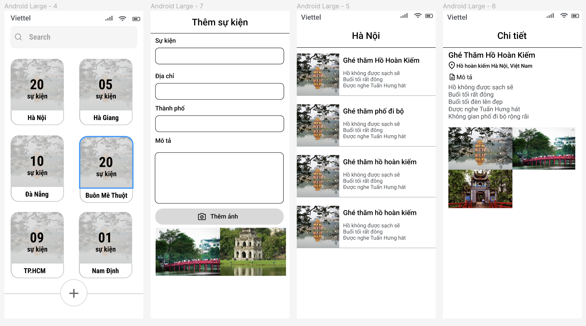

# 3. Travel Notes

## Sử dụng native android để xây dựng một ứng dụng cho phép người dùng ghi lại những cảnh quan, món ăn khi đi du lịch.

### Yêu cầu

1. Màn hình chính hiển thị các thành phố đã từng đến. Và 1 nút có thể thêm sự kiện. Ảnh đại diện có thể là ảnh đầu tiên của sự kiện thứ nhất

2. Màn hình thêm sự kiện bao gồm tên sự kiện, địa chỉ, chi tiết, ảnh...
  Chú ý: Địa điểm khi ấn vào có thể suggest tên địa điểm thông qua sử dụng vị trí trên thoại. Nếu địa điểm không đúng người dùng có thể sửa lại.

3. Màn hình hiển thị các sự kiện nơi bạn đã đến ví dụ đến một quán ăn ngon, một địa điểm đẹp. Ảnh đại diện cho sự kiện có thể là ảnh đầu tiên 

4. Màn hình thị chi tiết một sự kiện bao gồm tên sự kiện, chi tiết xảy ra, ảnh, địa chỉ....

5. Tất cả các hình ảnh sẽ được đồng bộ lên server. Chú ý không đẩy hình ảnh lên Imgur ngay sau khi thêm sự kiện. Sự kiện sẽ được đồng bộ mỗi tiếng 1 lần khi người dùng sử dụng mạng wifi và thiết bị đang ở chế độ sạc pin. Nếu ảnh nào đã được đồng bộ lên server rồi thì thôi không cần đồng bộ nữa.

Imgur: https://imgur.com/

API: https://api.imgur.com/

### Kỹ thuật

- Sử dụng WorkManager để thực hiện upload, đồng bộ dữ liệu.

- Sử dụng Room || SQLite để lưu trữ dữ liệu trên mobile.